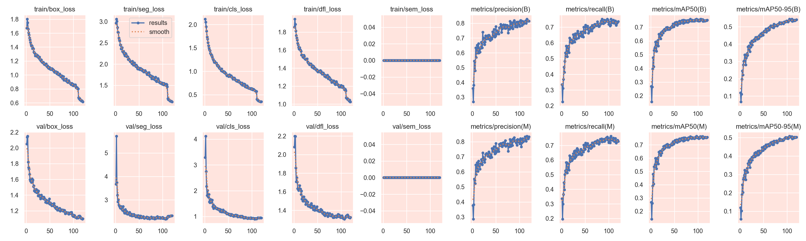

<p align="center">
  
</p>

# CityFix.AI — Pothole Segmentation + Smart Complaint & Repair Workflow

CityFix.AI is an end-to-end pothole intelligence system that combines:

- **YOLOv8 segmentation training** (computer vision in `CRDD/`)
- **FastAPI backend** for inference + complaint management (`Project/backend/`)
- **Multi-page web frontend** for public, worker, and admin flows (`Project/frontend/`)

It is designed for smart-city style workflows: detect potholes, collect complaints, assign repairs, and review closure with proof.

---

## 1) Project Structure

```text
Pothole_Segmentation_Project/
├── CRDD/
│   ├── Segmentation.ipynb
│   ├── project.ipynb
│   ├── requirements.txt
│   ├── Pothole_Segmentation_YOLOv8/
│   │   ├── data.yaml
│   │   ├── README.dataset.txt
│   │   ├── README.roboflow.txt
│   │   ├── train/
│   │   └── valid/
│   ├── runs/segment/train9/
│   │   ├── args.yaml
│   │   ├── results.csv
│   │   ├── results.png
│   │   ├── confusion_matrix*.png
│   │   ├── Box*.png
│   │   └── Mask*.png
│   └── model weights (*.pt)
│
├── Project/
│   ├── backend/
│   │   ├── main.py
│   │   ├── requirements.txt
│   │   ├── best.pt
│   │   └── database.json
│   └── frontend/
│       ├── index.html
│       ├── analytics.html
│       ├── complaint.html
│       ├── dashboard.html
│       ├── worker.html
│       └── assets/analytics/* (training graphs + validation visuals)
└── Pothole_Detection_Exhibition_Document.pdf
```

---

## 2) ML / Training Details

### Dataset

- Source: Roboflow (`farzad/pothole_segmentation_yolov8`, v1)
- License: **CC BY 4.0**
- Export format: **YOLOv8 segmentation**
- Classes: `1` (`Pothole`)
- Total images: **2100+**
- Input size preprocessing: **640x640**
- Augmentations include flip, crop, rotation, shear, brightness, and exposure adjustments.

Dataset metadata files:

- `CRDD/Pothole_Segmentation_YOLOv8/README.roboflow.txt`
- `CRDD/Pothole_Segmentation_YOLOv8/README.dataset.txt`
- `CRDD/Pothole_Segmentation_YOLOv8/data.yaml`

### Training Configuration (run: `train9`)

From `CRDD/runs/segment/train9/args.yaml`:

- Task: `segment`
- Base model: `yolov8m-seg.pt`
- Epochs: `120`
- Image size: `640`
- Batch size: `4`
- Optimizer: `auto`
- Learning rate (`lr0`): `0.0005`
- Mosaic: `0.7`, MixUp: `0.05`
- AMP: enabled

--------------------------------------------------------------------------------------------------------------------------------

## 🚨 Model Weights (Important)

Due to GitHub file size limits, large model files (`.pt`) are **not included in this repository**.

### 📥 Download Model Files

👉 Download all required model weights from here:
https://drive.google.com/drive/folders/1-7MIMo72D-V70WyjlnbqrUEaBVs1f9T6?usp=sharing


---

### 📁 After Download (Very Important)

Place the downloaded files in the following locations:

```
CRDD/
├── yolov8n-seg.pt
├── yolov8m-seg.pt
├── yolov8l-seg.pt
├── yolov8x-seg.pt

CRDD/runs/segment/train9/weights/
├── best.pt
├── last.pt

Project/backend/
├── best.pt
```

---

### ⚠️ Notes

* Make sure filenames remain **exactly same**
* Do not rename `.pt` files
* If paths are wrong, backend will fail to load model

---

### 🚀 Quick Fix (if error comes)

If model not loading:

* Check file path in `Project/backend/main.py`
* Use relative path:

  ```
  Project/backend/best.pt
  ```

---

### 💡 Why this is needed?

GitHub restricts files larger than **100MB**, so model weights must be downloaded separately.

--------------------------------------------------------------------------------------------------------------------------------


### Final Metrics (Epoch 120)

From `results.csv` final row:

- **Detection Precision (B)**: `0.8141`
- **Detection Recall (B)**: `0.7356`
- **Detection mAP50 (B)**: `0.7522`
- **Detection mAP50-95 (B)**: `0.5405`
- **Mask Precision (M)**: `0.8329`
- **Mask Recall (M)**: `0.7283`
- **Mask mAP50 (M)**: `0.7575`
- **Mask mAP50-95 (M)**: `0.5031`

---

## 3) Training Graphs & Validation Visuals

### Main training summary

- `CRDD/runs/segment/train9/results.png`



### Key curves

- `CRDD/runs/segment/train9/BoxF1_curve.png`
- `CRDD/runs/segment/train9/BoxPR_curve.png`
- `CRDD/runs/segment/train9/MaskF1_curve.png`
- `CRDD/runs/segment/train9/MaskPR_curve.png`

### Confusion matrices

- `CRDD/runs/segment/train9/confusion_matrix.png`
- `CRDD/runs/segment/train9/confusion_matrix_normalized.png`

### Frontend analytics assets

The web analytics page uses copies/variants in:

- `Project/frontend/assets/analytics/`

including:

- `loss curve 1.png`, `loss curve 2.png`, `loss curve 3.png`, `loss curve 4.png`
- `training and valodation loss.png`
- `Box*`, `Mask*`, confusion matrix images, and validation batch visuals.

---

## 4) Backend (FastAPI) Overview

Backend file: `Project/backend/main.py`

### Core features

- Loads YOLO model (`best.pt`) for inference
- Provides REST APIs for:
  - summary stats
  - public complaints
  - AI detections
  - image severity analysis
  - complaint creation + status update
- Stores data in `database.json`
- Serves frontend as static files from FastAPI

### Severity logic

Severity is inferred from segmentation mask area:

- `> 20000` → `CRITICAL`
- `> 10000` → `HIGH`
- `> 5000` → `MEDIUM`
- otherwise → `LOW`

### Main API endpoints

- `GET /api/v1/stats/summary`
- `GET /api/v1/public_complaints`
- `GET /api/v1/ai_detections`
- `POST /api/v1/analyze_image`
- `POST /api/v1/public_complaints`
- `PUT /api/v1/public_complaints/{complaint_id}`
- `POST /api/v1/run_ai_analysis`

---

## 5) Frontend Pages

- `index.html` → project landing + architecture + performance highlights
- `analytics.html` → training curves, confusion matrices, validation visualizations
- `complaint.html` → citizen complaint form (GPS + image/video upload + AI severity preview)
- `worker.html` → worker update flow (in-progress / pending-review + proof image + GPS)
- `dashboard.html` → admin inspection and complaint review/approval

All pages are built using HTML + Tailwind CDN + vanilla JS.

---

## 6) How to Run Locally

## 6.1 Prerequisites

- Python 3.9+
- pip
- (Optional) virtual environment

## 6.2 Install dependencies

From project root:

```bash
pip install -r CRDD/requirements.txt
```

> Note: backend `requirements.txt` has only FastAPI stack, but `main.py` also uses `ultralytics`, `opencv-python`, `numpy`. Installing from `CRDD/requirements.txt` covers these.

## 6.3 Start server

```bash
python Project/backend/main.py
```

Backend starts at:

- `http://127.0.0.1:8000`

Because frontend is mounted by FastAPI static files, opening this URL serves the web UI.

---

## 7) Important Path Note for GitHub/Other Machines

In `Project/backend/main.py`, model and frontend paths are currently **absolute Windows paths**.

If you clone this repository to another machine, update these lines to relative paths (recommended):

- model path → `Project/backend/best.pt`
- static directory → `Project/frontend`

Otherwise, backend may fail to load model or serve frontend.

---

## 8) Suggested Quick Test Flow

1. Open `http://127.0.0.1:8000`
2. Go to **Register Complaint** (`complaint.html`), submit with image.
3. Open **Worker Portal** (`worker.html`), mark as "Pending Review" with proof image + GPS.
4. Open **Inspection Portal** (`dashboard.html`), review and approve.
5. Open **Advanced Analytics** (`analytics.html`) to view training/performance graphs.

---

## 9) GitHub Setup (Push this project)

From project root:

```bash
git init
git add .
git commit -m "Initial commit: CityFix AI pothole segmentation and web platform"
git branch -M main
git remote add origin https://github.com/<your-username>/<your-repo>.git
git push -u origin main
```

Replace `<your-username>` and `<your-repo>` with your actual GitHub details.

---

## 10) Tech Stack

- **AI/ML**: Ultralytics YOLOv8 (segmentation), PyTorch
- **Backend**: FastAPI, Uvicorn, Pydantic
- **Computer Vision**: OpenCV, NumPy
- **Frontend**: HTML, TailwindCSS (CDN), JavaScript
- **Data storage**: JSON-based local file (`database.json`)

---

## 11) Included Models / Artifacts

- Multiple `.pt` files in `CRDD/` (`yolov8n/m/l/x-seg.pt`, etc.)
- Trained weights in `CRDD/runs/segment/train9/weights/` (`best.pt`, `last.pt`)
- Deployed backend weight in `Project/backend/best.pt`

---

## 12) License / Dataset Attribution

Dataset attribution from source files:

- Roboflow Universe dataset by workspace/project owner
- License: **CC BY 4.0**

Please preserve attribution if redistributing dataset-derived artifacts.


